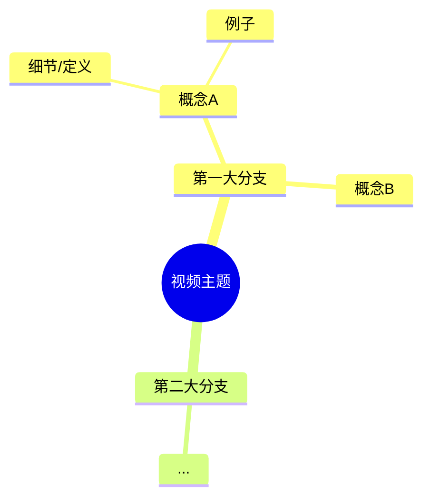
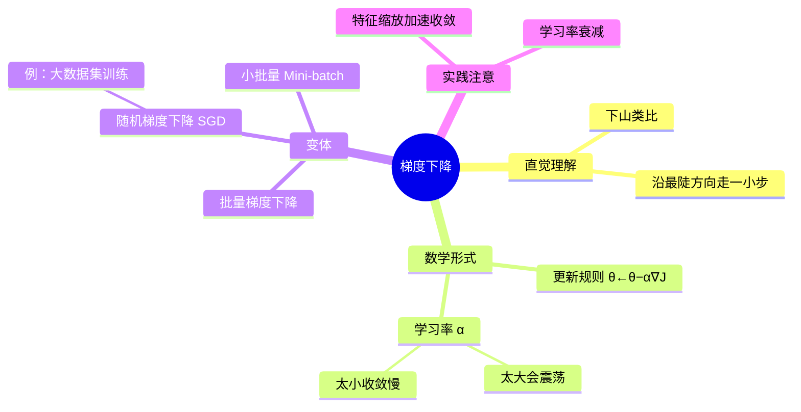

# 知识点脑图写法规范

产出文件为 `mindmap.md`，核心是一个 Mermaid `mindmap` 代码块。Mermaid 在
GitHub、Obsidian、Typora 及 Claude 的 Artifact 中都能直接渲染。

## 文件结构

````markdown
# <视频标题> · 知识点脑图

> 视频时长 X 分钟 | 共 N 个知识点 | 生成自转录稿



## 分支速览

- **第一大分支**：一句话说明该分支讲了什么（对应时间段 [MM:SS]–[MM:SS]）
- **第二大分支**：……
````

"分支速览"部分给每个一级分支一句话说明和时间范围——脑图本身不放时间戳
（会让节点变长、图变乱），时间定位放在速览里。

## Mermaid mindmap 语法要点

- 缩进（2 空格一级）决定层级，没有连线符号
- 根节点 `root((文本))` 用双圆括号显示为圆形
- **节点文本避免使用这些字符**：`(` `)` `[` `]` `{` `}` `:` `"`，它们是 Mermaid
  的形状/语法符号，会导致渲染失败。中文括号（）、冒号：、引号""是安全的，
  需要时用中文标点替代
- 节点文本保持短语级长度（一般 ≤ 15 个汉字 / 8 个英文单词），长解释放进笔记，
  不放脑图

## 内容组织原则

- **按知识结构组织，不按时间顺序**。视频常来回穿插同一主题，脑图要把它们
  归到一起。一级分支通常 3–7 个，对应视频的核心议题
- **覆盖度是硬指标**：通读转录稿后自查——视频中每个被讲解（而非一带而过）的
  概念、方法、公式、例子、结论、注意事项，都应有对应节点。做完后从头扫一遍
  转录稿核对，漏了就补
- **粒度自上而下递减**：一级分支是议题，二级是概念/方法，三级是定义、步骤、
  例子、对比等细节。同一层的节点粒度应大致相当
- **例子也是知识点**：主讲人举的例子挂在对应概念下（如 `例：手写数字识别`）
- 视频里明确的结论/口诀/公式，用尽量接近原话的短语呈现

## 示例


